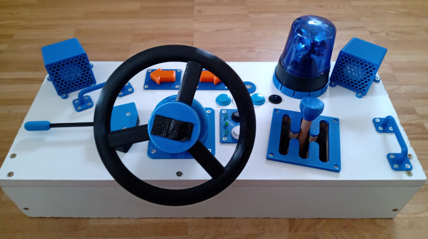

Car Console
===========

A simple application to control LEDs and acutators on a
[Raspberry Pi](https://www.raspberrypi.org) to simulate a car console as toy
for kids.

#### Table of Contents

1. [Installation](#installation)
1. [Implemented components](#implemented-components)

# Installation

1. Clone this repo
1. Run the `run.sh` in the repo's directory

# Implemented components

1. Battery indicator
1. Engine
1. Turn signals
1. Siren
1. Media player
